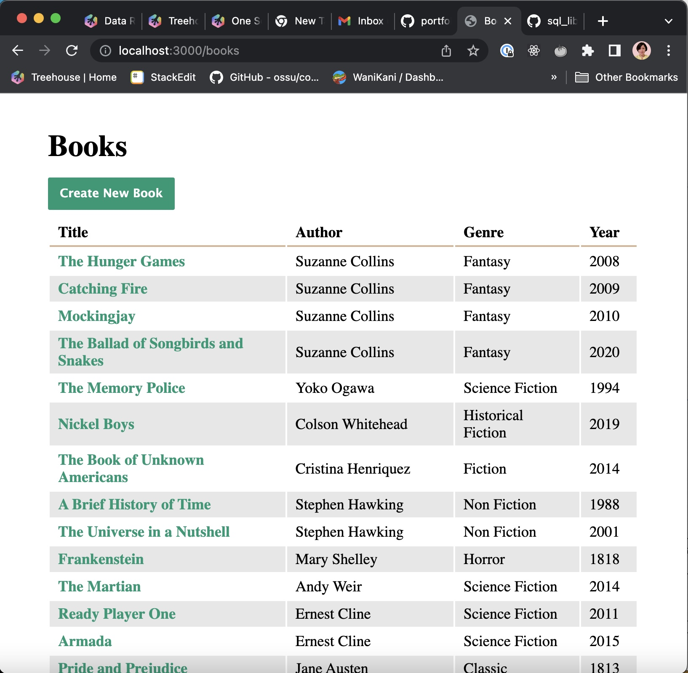
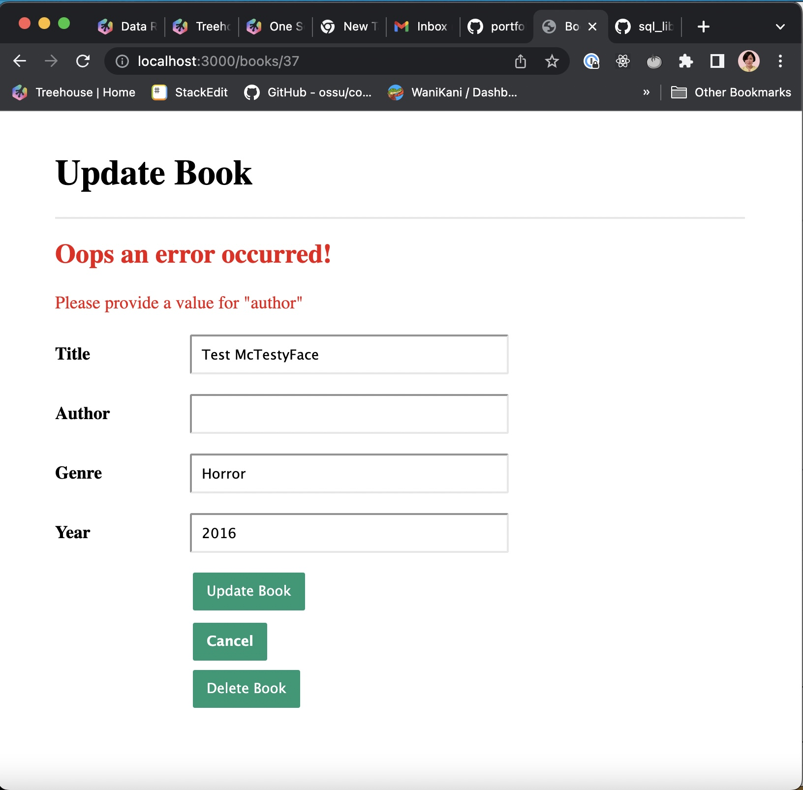

# Treehouse Techdegree FSJS
## Project 8- SQL Library Manager

A single-page application(SPA) using React and React Router 5 that displays a collection of 24 photos using the Flicker API.

## Technologies
* HTML
* CSS
* JavaScript
* Node.js
* Express.js
* SQLite
* Sequelize ORM
* Pug

## Installation
- Downlod the project files
- run `npm install` to install all project dependencies

## About this Project

This project uses a Express and Sequelize to handle routing and CRUD operations for this library App.

The home ('/') screen redirects to ('/books') where the app.js pulss all the books stored in the library databased following the book model created using Sequelized

It also include helpful messages for fields that have validations such as Title and Author

And it handles 404 errors for any request that has a book not included in the database

Finally, you can test `localhost:3000/500error` to test for the server side error
